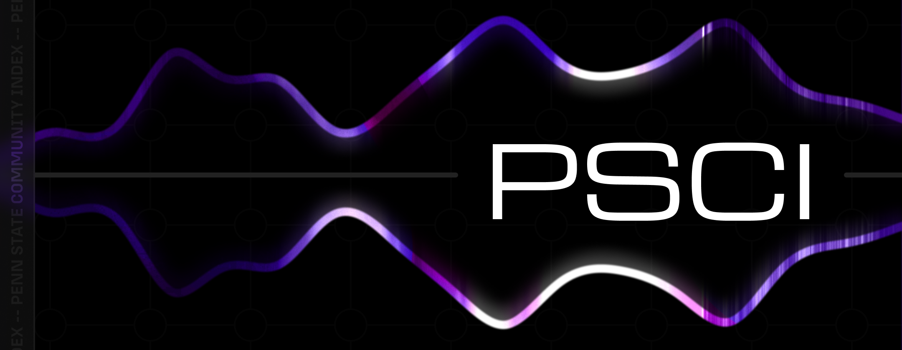

# Penn State Communities Index



The **Penn State Communities Index** is an unofficial initiative aimed at fostering community and connection among Penn State students. This lightweight and efficient project provides a centralized platform to discover and join various group chats (GCs) for different interests, classes, and communities within Penn State.

## Features

- **Dynamic Tag Filtering**: Easily filter communities by tags like "Class of 2029," "Residence Halls," or "Recently Added."
- **Search Functionality**: Quickly search for communities by name, description, or tags.
- **Responsive Design**: Fully responsive layout optimized for both desktop and mobile devices.
- **Lightweight Codebase**: The entire project is less than **100kB**, making it fast and efficient to load.
- **Customizable Tags**: Tags are dynamically generated and can be easily updated.

## Contribution Guide

We welcome contributions to make PSCI even better! Follow these simple steps to add new group chats (GCs) or improve the project:

1. **Install TailwindCSS CLI**:

   ```bash
   npm install tailwindcss @tailwindcss/cli
   ```

2. **Create an `input.css` File**:
   In the root directory, create a file named `input.css` and add the following line:

   ```css
   @import "tailwindcss";
   ```

3. **Clone the Repository**:
   Clone this repository into a `src` folder:

   ```bash
   git clone https://github.com/PSCIndex/PSCIndex.github.io src
   ```

4. **Generate the CSS**:
   Run the following command to generate the `styles.css` file:

   ```bash
   npx @tailwindcss/cli -i ./input.css -o ./src/styles.css --watch --minify --optimize
   ```

5. **Add New Communities**:

   - Open the `src/index.html` file.
   - Add a new community card in the `#communities-grid` section. Use the existing cards as a template.
   - Ensure the `data-tags` & `data-date` attributes are updated with relevant information for filtering.

6. **Commit and Push**:
   Once you've made your changes, commit and push them to the repository. After that, create a pull request for review.

## Credits

This project is made possible by the efforts of the following individuals:

- **XelXen** - Lead Developer
- **Anshoeman7** - Contributor
- **Amrutha** - Representative

---

PSCI is not affiliated with Pennsylvania State University or any of its campuses. This is an unofficial initiative maintained by students.
